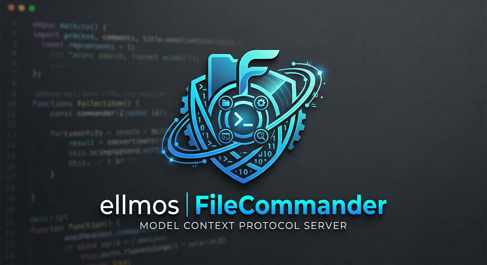

<p align="center">
  
</p>

# ellmos FileCommander MCP Server

**🇬🇧 [English Version](README.md)**

*Teil der [ellmos-ai](https://github.com/ellmos-ai) Familie.*

[](https://opensource.org/licenses/MIT)
[](https://www.npmjs.com/package/ellmos-filecommander-mcp)
[](https://nodejs.org/)
[](https://github.com/ellmos-ai/ellmos-filecommander-mcp/actions/workflows/tests.yml)

Ein umfassender **Model Context Protocol (MCP) Server**, der KI-Assistenten vollen Dateisystemzugriff, Prozessverwaltung, interaktive Shell-Sitzungen und asynchrone Dateisuche bietet.

**44 Tools** in einem einzigen Server — alles, was ein KI-Agent für die Interaktion mit dem lokalen System braucht.

**Discovery-Suchbegriffe:** lokaler Dateisystem-MCP-Server, Safe-Delete-MCP, Papierkorb-MCP-Server, Prozessverwaltungs-MCP, interaktive Shell per MCP, asynchrone Dateisuche für KI-Agenten, Markdown-zu-PDF-MCP, OCR-MCP-Server.

**Registry-Status:** auf [npm](https://www.npmjs.com/package/ellmos-filecommander-mcp) veröffentlicht, auf [Glama](https://glama.ai/mcp/servers/eyurifgg4t) gelistet und über [`server.json`](server.json) für die offizielle MCP Registry vorbereitet. Glama indexiert aktuell die Repository-Metadaten, meldet aber noch `tools: []`; nach dem nächsten npm-Patchrelease sollte dort ein Reindex angestoßen werden.

---

## Warum FileCommander?

Die meisten Dateisystem-MCP-Server decken nur grundlegende Lese-/Schreiboperationen ab. FileCommander geht weiter:

- **Safe Delete** — Verschiebt Dateien in den Papierkorb (Windows) oder Trash (macOS/Linux) statt permanenter Löschung
- **Interaktive Sitzungen** — REPLs starten und bedienen (Python, Node.js, Shells) über das MCP-Protokoll
- **Asynchrone Suche** — Große Verzeichnisbäume im Hintergrund durchsuchen, während die KI weiterarbeitet
- **Prozessverwaltung** — Systemprozesse auflisten, starten und beenden
- **String Replace** — Dateien bearbeiten durch eindeutigen Stringabgleich mit Kontextvalidierung
- **Formatkonvertierung** — Konvertierung zwischen JSON, CSV, INI, YAML, TOML, XML und TOON
- **ZIP-Archive** — ZIP-Archive erstellen, entpacken und auflisten
- **Prüfsummen** — SHA-256, MD5, SHA-1, SHA-512 Hashing mit Vergleichsfunktion
- **OCR** — Texterkennung aus Bildern (optionale tesseract.js-Abhängigkeit)
- **Safety Mode** — Umschalten, damit alle Löschvorgänge über den Papierkorb / Trash laufen
- **Markdown-Export** — Markdown in professionelles HTML/PDF konvertieren mit Codeblöcken, Tabellen, verschachtelten Listen, Blockzitaten
- **Cloud-Lock-sicher** — Automatischer copy+delete-Fallback wenn Cloud-Sync-Filter (OneDrive, Dropbox, Google Drive, iCloud) rename-Operationen blockieren
- **Cloud-Lock-Diagnose** — Prüft ob ein Pfad von Sync-Filter-Konflikten betroffen sein könnte
- **Plattformübergreifend** — Funktioniert auf Windows, macOS und Linux mit plattformspezifischen Optimierungen

---

## Installation

### Voraussetzungen

- [Node.js](https://nodejs.org/) 18 oder höher
- npm

### Option 1: Installation über NPM

```bash
npm install -g ellmos-filecommander-mcp
```

### Option 2: Installation aus dem Quellcode

```bash
git clone https://github.com/ellmos-ai/ellmos-filecommander-mcp.git
cd ellmos-filecommander-mcp
npm install
npm run build
```

---

## Konfiguration

### Claude Desktop

Zur `claude_desktop_config.json` hinzufügen:

**Windows:** `%APPDATA%\Claude\claude_desktop_config.json`
**macOS:** `~/Library/Application Support/Claude/claude_desktop_config.json`

#### Bei globaler Installation über NPM:

```json
{
  "mcpServers": {
    "filecommander": {
      "command": "ellmos-filecommander"
    }
  }
}
```

#### Bei Installation aus dem Quellcode:

```json
{
  "mcpServers": {
    "filecommander": {
      "command": "node",
      "args": ["/absolute/path/to/filecommander-mcp/dist/index.js"]
    }
  }
}
```

Claude Desktop nach dem Speichern neu starten.

### Andere MCP-Clients

Der Server kommuniziert über **stdio transport**. Verweisen Sie Ihren MCP-Client auf den `dist/index.js` Einstiegspunkt oder die `ellmos-filecommander` Binary.

---

## Übersicht der Tools

### Dateisystemoperationen (14 Tools)

| Tool | Beschreibung |
|------|-------------|
| `fc_read_file` | Dateiinhalt lesen mit optionalem Zeilenlimit |
| `fc_read_multiple_files` | Bis zu 20 Dateien in einem Aufruf lesen |
| `fc_write_file` | Dateien schreiben/erstellen/anhängen |
| `fc_edit_file` | Zeilenbasiertes Bearbeiten (Ersetzen, Einfügen, Löschen) |
| `fc_str_replace` | Eindeutigen String in einer Datei ersetzen mit Kontextvalidierung |
| `fc_list_directory` | Verzeichnisinhalt auflisten (rekursiv, konfigurierbare Tiefe) |
| `fc_create_directory` | Verzeichnisse erstellen (einschließlich Elternverzeichnisse) |
| `fc_delete_file` | Datei löschen (permanent) |
| `fc_delete_directory` | Verzeichnis löschen (mit optionalem rekursivem Flag) |
| `fc_safe_delete` | In Papierkorb / Trash verschieben (wiederherstellbar!) |
| `fc_move` | Dateien und Verzeichnisse verschieben oder umbenennen (Cloud-Lock-sicher) |
| `fc_copy` | Dateien und Verzeichnisse kopieren |
| `fc_file_info` | Detaillierte Dateimetadaten abrufen (Größe, Daten, Typ) |
| `fc_search_files` | Synchrone Dateisuche mit Wildcard-Mustern |

### Asynchrone Suche (5 Tools)

| Tool | Beschreibung |
|------|-------------|
| `fc_start_search` | Hintergrundsuche starten (kehrt sofort zurück) |
| `fc_get_search_results` | Ergebnisse mit Paginierung abrufen |
| `fc_stop_search` | Laufende Suche abbrechen |
| `fc_list_searches` | Alle aktiven/abgeschlossenen Suchen auflisten |
| `fc_clear_search` | Abgeschlossene Suchen aus dem Speicher entfernen |

### Prozessverwaltung (4 Tools)

| Tool | Beschreibung |
|------|-------------|
| `fc_execute_command` | Shell-Befehl ausführen (blockierend, mit Timeout) |
| `fc_start_process` | Hintergrundprozess starten (nicht-blockierend) |
| `fc_list_processes` | Laufende Systemprozesse auflisten |
| `fc_kill_process` | Prozess nach PID oder Name beenden |

### Interaktive Sitzungen (5 Tools)

| Tool | Beschreibung |
|------|-------------|
| `fc_start_session` | Interaktiven Prozess starten (Python, Node, Shell...) |
| `fc_read_output` | Sitzungsausgabe lesen |
| `fc_send_input` | Eingabe an laufende Sitzung senden |
| `fc_list_sessions` | Alle Sitzungen auflisten |
| `fc_close_session` | Sitzung beenden |

### Dateiwartung & Reparatur (9 Tools)

| Tool | Beschreibung |
|------|-------------|
| `fc_fix_json` | Defektes JSON reparieren (BOM, nachgestellte Kommas, Kommentare, einfache Anführungszeichen) |
| `fc_validate_json` | JSON validieren mit detaillierter Fehlerposition und Kontext |
| `fc_cleanup_file` | BOM, NUL-Bytes, nachgestellte Leerzeichen entfernen, Zeilenenden normalisieren |
| `fc_fix_encoding` | Mojibake / doppelt kodiertes UTF-8 reparieren (27+ Zeichenmuster) |
| `fc_folder_diff` | Verzeichnisänderungen mit Snapshots verfolgen (neu/geändert/gelöscht) |
| `fc_batch_rename` | Musterbasierte Massenumbenennung (Präfix/Suffix, Ersetzen, Auto-Erkennung) |
| `fc_convert_format` | Konvertierung zwischen JSON, CSV, INI, YAML, TOML, XML und TOON |
| `fc_detect_duplicates` | Doppelte Dateien mittels SHA-256-Hashing finden |
| `fc_checksum` | Datei-Hashing (MD5, SHA-1, SHA-256, SHA-512) mit optionalem Vergleich |

### Archiv (1 Tool)

| Tool | Beschreibung |
|------|-------------|
| `fc_archive` | ZIP-Archive erstellen, entpacken und auflisten |

### OCR (1 Tool)

| Tool | Beschreibung |
|------|-------------|
| `fc_ocr` | Texterkennung aus Bildern über tesseract.js (optionale Abhängigkeit) |

### Cloud Sync (1 Tool)

| Tool | Beschreibung |
|------|-------------|
| `fc_check_cloud_lock` | Diagnose ob ein Pfad von Cloud-Sync-Filtern blockiert werden könnte (Windows) |

### System (2 Tools)

| Tool | Beschreibung |
|------|-------------|
| `fc_get_time` | Aktuelle Systemzeit mit Zeitzoneninformation abrufen |
| `fc_set_safe_mode` | Safety Mode umschalten: alle Löschvorgänge über Papierkorb / Trash |

### Export (2 Tools)

| Tool | Beschreibung |
|------|-------------|
| `fc_md_to_html` | Markdown zu eigenständigem HTML mit CSS-Styling (Überschriften, Codeblöcke, Tabellen, verschachtelte Listen, Blockzitate, Bilder, Checkboxen) |
| `fc_md_to_pdf` | Markdown zu PDF über Headless-Browser (Edge/Chrome). Fällt auf HTML zurück, wenn kein Browser verfügbar ist |

**Gesamt: 44 Tools**

---

## Vergleich mit Alternativen

| Feature | FileCommander | [Desktop Commander](https://github.com/wonderwhy-er/DesktopCommanderMCP) | [Official Filesystem](https://www.npmjs.com/package/@modelcontextprotocol/server-filesystem) |
|---------|:---:|:---:|:---:|
| Dateien lesen/schreiben/kopieren/verschieben | 14 Tools | Ja | Ja |
| Safe Delete (Papierkorb) | Ja | Nein | Nein |
| Asynchrone Hintergrundsuche | 5 Tools | Nein | Nein |
| Interaktive Sitzungen (REPL) | 5 Tools | Ja | Nein |
| Prozessverwaltung | 4 Tools | Ja | Nein |
| Shell-Befehlsausführung | Ja | Ja | Nein |
| String Replace mit Validierung | Ja | Ja | Nein |
| Zeilenbasierte Dateibearbeitung | Ja | Nein | Nein |
| JSON-Reparatur & Validierung | 2 Tools | Nein | Nein |
| Encoding-Reparatur (Mojibake) | Ja | Nein | Nein |
| Duplikaterkennung (SHA-256) | Ja | Nein | Nein |
| Verzeichnis-Diff / Änderungsverfolgung | Ja | Nein | Nein |
| Massenumbenennung (musterbasiert) | Ja | Nein | Nein |
| Formatkonvertierung (JSON/CSV/INI/YAML/TOML/XML/TOON) | Ja | Nein | Nein |
| ZIP-Archiv (erstellen/entpacken/auflisten) | Ja | Nein | Nein |
| Datei-Prüfsummen (SHA-256/MD5) | Ja | Nein | Nein |
| OCR (Bild zu Text) | Optional | Nein | Nein |
| Safety Mode (Löschen → Papierkorb) | Ja | Nein | Nein |
| Pfad-Allowlist / Sandboxing | Nein | Nein | Ja |
| Excel / PDF-Unterstützung | PDF (über Browser) | Ja | Nein |
| HTTP Transport | Nein | Nein | Nein |
| Markdown zu HTML/PDF Export | Ja | Nein | Nein |
| **Tools gesamt** | **44** | ~15 | ~11 |
| **Benötigte Server** | **1** | 1 | + extra für Prozesse |

**Hauptunterscheidungsmerkmale:**
- Einziger MCP-Server mit **wiederherstellbarem Löschen** (Papierkorb / Trash)
- Einziger MCP-Server mit **asynchroner Hintergrundsuche** mit Paginierung
- Integrierte **JSON-Reparatur**, **Encoding-Korrektur** und **Duplikaterkennung**
- Einziger MCP-Server mit **Cloud-Lock-sicheren Dateioperationen** (automatischer copy+delete-Fallback)
- Umfassendste Einzelserver-Lösung (44 Tools)
- Integrierter **Safety Mode** zur Vermeidung versehentlicher permanenter Löschungen

---

## Tool-Präfix

Alle Tools verwenden das `fc_`-Präfix (FileCommander), um Konflikte mit anderen MCP-Servern zu vermeiden.

---

## Auffindbarkeit

FileCommander ist so dokumentiert, dass Menschen, LLMs und MCP-Verzeichnisse ihn eindeutig einordnen können:

- `package.json` enthält den offiziellen `mcpName` (`io.github.ellmos-ai/ellmos-filecommander-mcp`) und MCP-spezifische npm-Keywords.
- [`server.json`](server.json) folgt dem offiziellen MCP-Registry-Schema und verweist auf das npm-Paket.
- [`glama.json`](glama.json) liefert Metadaten für Glama-kompatible MCP-Verzeichnisse.
- [`llms.txt`](llms.txt) bietet kompakten Kontext für LLMs, Agentenkataloge und Dokumentations-Crawler.

Primäre Suchbegriffe: `ellmos-filecommander-mcp`, `FileCommander MCP`, `filesystem MCP server`, `safe delete MCP`, `async file search MCP`, `process management MCP`, `Markdown PDF MCP`.

---

## Sicherheit

**Dieser Server hat vollen Dateisystemzugriff mit den Berechtigungen des ausführenden Benutzers.**

Siehe [SECURITY.md](SECURITY.md) für detaillierte Sicherheitsinformationen und Empfehlungen.

Wichtige Punkte:
- `fc_execute_command` führt beliebige Shell-Befehle aus
- `fc_delete_*` Tools löschen standardmäßig permanent (verwenden Sie `fc_safe_delete` oder aktivieren Sie den **Safety Mode** über `fc_set_safe_mode`, um alle Löschvorgänge über den Papierkorb / Trash zu leiten)
- Kein eingebautes Sandboxing — die Sicherheit wird an die MCP-Client-Schicht delegiert
- Ausschließlich für lokale Nutzung über stdio transport konzipiert

---

## Entwicklung

```bash
# Abhängigkeiten installieren
npm install

# Watch-Modus (automatischer Rebuild bei Änderungen)
npm run dev

# Einmaliger Build
npm run build

# Server starten
npm start

# Tests ausführen
npm test
```

### Tests

Das Projekt enthält eine umfassende Test-Suite mit **143 Tests** für Dateisystem-Operationen, Format-Konvertierung, Encoding-Reparatur, Archiv-Handling, Duplikat-Erkennung und mehr.

```bash
npm test              # Alle Tests ausführen
npx vitest --watch    # Watch-Modus
```

Tests sind auf **Windows**, **macOS** und **Linux** verifiziert.
Pushes und Pull Requests laufen in CI auf Node.js **20**, **22** und **24** mit `npm ci`, TypeScript-Build, Vitest und npm-Paket-Dry-Run.

Siehe [CONTRIBUTING.md](CONTRIBUTING.md) für Richtlinien zur Mitwirkung.

---

## Änderungsprotokoll

Siehe [CHANGELOG.md](CHANGELOG.md) für die vollständige Versionshistorie.

---

## Lizenz

[MIT](LICENSE) — Lukas Geiger ([ellmos-ai](https://github.com/ellmos-ai))

---

## Geschichte

Dieses Projekt wurde ursprünglich als **BACH FileCommander** (`bach-filecommander-mcp`) entwickelt. Es wurde im Rahmen der [ellmos-ai](https://github.com/ellmos-ai) Organisation in **ellmos FileCommander** (`ellmos-filecommander-mcp`) umbenannt.

Der alte Paketname `bach-filecommander-mcp` ist veraltet. Bitte verwenden Sie stattdessen [`ellmos-filecommander-mcp`](https://www.npmjs.com/package/ellmos-filecommander-mcp):

```bash
npm uninstall -g bach-filecommander-mcp
npm install -g ellmos-filecommander-mcp
```

---

## ellmos-ai-Ökosystem

Dieser MCP-Server ist Teil des **[ellmos-ai](https://github.com/ellmos-ai)**-Ökosystems: KI-Infrastruktur, MCP-Server und intelligente Werkzeuge.

### MCP-Server-Familie

| Server | Tools | Fokus | npm |
|--------|-------|-------|-----|
| **[FileCommander](https://github.com/ellmos-ai/ellmos-filecommander-mcp)** | **44** | **Dateisystem, Prozessverwaltung, interaktive Sitzungen, Cloud-Lock-sicher** | **[`ellmos-filecommander-mcp`](https://www.npmjs.com/package/ellmos-filecommander-mcp)** |
| [CodeCommander](https://github.com/ellmos-ai/ellmos-codecommander-mcp) | 17 | Code-Analyse, AST-Parsing, Import-Verwaltung | [`ellmos-codecommander-mcp`](https://www.npmjs.com/package/ellmos-codecommander-mcp) |
| [Clatcher](https://github.com/ellmos-ai/ellmos-clatcher-mcp) | 12 | Dateireparatur, Formatkonvertierung, Batch-Operationen | [`ellmos-clatcher-mcp`](https://www.npmjs.com/package/ellmos-clatcher-mcp) |
| [n8n Manager](https://github.com/ellmos-ai/n8n-manager-mcp) | 18 | n8n-Workflow-Verwaltung über KI-Assistenten | [`n8n-manager-mcp`](https://www.npmjs.com/package/n8n-manager-mcp) |
| [ControlCenter](https://github.com/ellmos-ai/ellmos-controlcenter-mcp) | 10 | MCP-Stack-Discovery, Profilverwaltung, Control Plane | [`ellmos-controlcenter-mcp`](https://www.npmjs.com/package/ellmos-controlcenter-mcp) |
| [Homebase](https://github.com/ellmos-ai/ellmos-homebase-mcp) | 44 | LLM-Gedächtnis, Wissensbasis, Zustand, Routing und Orchestrierung | [`ellmos-homebase-mcp`](https://www.npmjs.com/package/ellmos-homebase-mcp) (alpha) |
| [ServerCommander](https://github.com/ellmos-ai/ellmos-servercommander-mcp) | 8 | Server-Operationen: Deploy-Dry-Runs, Mail, Log-Analyse, Health-Checks | [`ellmos-servercommander-mcp`](https://www.npmjs.com/package/ellmos-servercommander-mcp) (alpha) |

### KI-Infrastruktur

| Projekt | Beschreibung |
|---------|-------------|
| [BACH](https://github.com/ellmos-ai/bach) | Textbasiertes Betriebssystem für LLMs: Handler, Tools und Skills |
| [clutch](https://github.com/ellmos-ai/clutch) | Provider-neutrale LLM-Orchestrierung mit Auto-Routing und Budget-Tracking |
| [rinnsal](https://github.com/ellmos-ai/rinnsal) | Leichte Agent-Memory-, Connector- und Automatisierungsinfrastruktur |
| [ellmos-stack](https://github.com/ellmos-ai/ellmos-stack) | Self-hosted AI Research Stack |
| [MarbleRun](https://github.com/ellmos-ai/MarbleRun) | Autonomes Agent-Chain-Framework für Claude Code |
| [gardener](https://github.com/ellmos-ai/gardener) | Minimalistischer datenbankgetriebener LLM-OS-Prototyp |
| [ellmos-tests](https://github.com/ellmos-ai/ellmos-tests) | Testframework für LLM-Betriebssysteme |

### Desktop-Software

Unsere Partnerorganisation **[open-bricks](https://github.com/open-bricks)** bündelt KI-native Desktop-Anwendungen: eine moderne Open-Source-Softwaresuite für Datei-, Dokumenten- und Entwicklerwerkzeuge.
